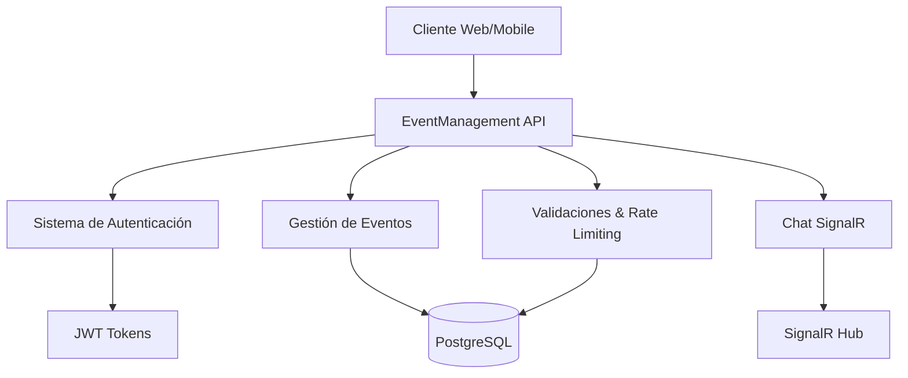

# 🎪 Gestor de Eventos API

### Sistema Integral de Gestión de Eventos con Chat en Tiempo Real

[](https://dotnet.microsoft.com/)
[](https://www.postgresql.org/)
[](https://docs.microsoft.com/en-us/aspnet/core/signalr/)
[](https://jwt.io/)
[](https://www.docker.com/)

---

## 📋 Descripción

**Gestor de Eventos API** es una plataforma completa para la gestión de eventos que incluye autenticación robusta, sistema de roles, registro a eventos y chat en tiempo real. Construida con las mejores prácticas de desarrollo y arquitectura escalable.

### ✨ Características Principales

- 🔐 **Autenticación JWT** con sistema de roles (Admin, Organizador, Usuario)
- 🎉 **Gestión completa de eventos** (CRUD con validaciones avanzadas)
- 👥 **Sistema de registro** a eventos con capacidad límite
- 💬 **Chat en tiempo real** por evento usando SignalR
- 🛡️ **Validaciones robustas** con rate limiting anti-spam
- 📊 **API RESTful** con documentación Swagger automática
- 🎨 **Interfaz de prueba** completa incluida
- 📱 **Responsive y escalable** para cualquier frontend

---

## 🏗️ Arquitectura



### 🎯 Tecnologías Utilizadas

| Categoría | Tecnología | Versión | Propósito |
|-----------|------------|---------|-----------|
| **Backend** | ASP.NET Core | 7.0+ | Framework web principal |
| **Base de Datos** | PostgreSQL | 13+ | Almacenamiento de datos |
| **ORM** | Entity Framework Core | 7.0+ | Mapeo objeto-relacional |
| **Autenticación** | JWT Bearer | - | Tokens de acceso seguro |
| **Chat Tiempo Real** | SignalR | 6.0+ | Comunicación bidireccional |
| **Validaciones** | Data Annotations + Custom | - | Validación de datos robusta |
| **Documentación** | Swagger/OpenAPI | 6.0+ | Documentación automática |
| **Testing** | xUnit + Moq | - | Pruebas unitarias |
| **Containerización** | Docker | - | Despliegue en contenedores |

---

## 🚀 Instalación y Configuración

### Requisitos Previos

- [.NET 7 SDK](https://dotnet.microsoft.com/download) o superior
- [PostgreSQL](https://www.postgresql.org/download/) 13 o superior
- [Git](https://git-scm.com/) para clonar el repositorio

### 🔧 Configuración Paso a Paso

#### 1. **Clonar el Repositorio**
```bash
git clone https://github.com/Brian13b/EventManagementAPI.git
cd EventManagementAPI
```

#### 2. **Restaurar Paquetes NuGet**
```bash
dotnet restore
```

#### 3. **Configurar Base de Datos**

Actualiza `appsettings.json` con tu configuración:
```json
{
  "ConnectionStrings": {
    "DefaultConnection": "Host=localhost;Port=5432;Username=usuario;Password=password;Database=EventManagementDb"
  },
  "Jwt": {
    "Key": "tu-clave-jwt-super-secreta-minimo-32-caracteres",
    "Issuer": "EventManagementAPI",
    "Audience": "EventManagementClients",
    "ExpiryInHours": 24
  }
}
```

#### 4. **Ejecutar Migraciones**
```bash
dotnet ef database update
```

#### 5. **Ejecutar la Aplicación**
```bash
dotnet run
```

### 🎉 ¡Listo para Usar!

- **API**: `https://localhost:5135`
- **Swagger UI**: `https://localhost:5135/swagger`
- **Página de Prueba**: `https://localhost:5135/chat-test.html`
- **SignalR Hub**: `https://localhost:5135/chathub`

---

## 🎮 Guía de Uso Rápido

### 🔐 Autenticación

#### Registrar Usuario
```bash
curl -X POST https://localhost:5135/api/auth/register \
  -H "Content-Type: application/json" \
  -d '{
    "username": "nuevo_usuario",
    "email": "usuario@ejemplo.com",
    "password": "Password123!",
    "confirmPassword": "Password123!"
  }'
```

#### Iniciar Sesión
```bash
curl -X POST https://localhost:5135/api/auth/login \
  -H "Content-Type: application/json" \
  -d '{
    "email": "usuario@ejemplo.com",
    "password": "Password123!"
  }'
```

### 🎉 Gestión de Eventos

#### Listar Eventos
```bash
curl -H "Authorization: Bearer TU_JWT_TOKEN" \
     https://localhost:5135/api/events
```

#### Crear Evento (Organizador/Admin)
```bash
curl -X POST https://localhost:5135/api/events \
  -H "Authorization: Bearer TU_JWT_TOKEN" \
  -H "Content-Type: application/json" \
  -d '{
    "title": "Mi Evento Increíble",
    "description": "Descripción del evento",
    "date": "2024-12-25T18:00:00Z",
    "location": "Centro de Convenciones",
    "maxCapacity": 100,
    "price": 25.50,
    "category": "Conferencia"
  }'
```

#### Registrarse a Evento
```bash
curl -X POST https://localhost:5135/api/events/1/register \
     -H "Authorization: Bearer TU_JWT_TOKEN"
```

### 💬 Chat en Tiempo Real

El chat utiliza **SignalR** para comunicación bidireccional. Consulta la página de prueba incluida para ejemplos de implementación con JavaScript.

---

## 📚 Documentación de la API

### 🔗 Endpoints Principales

| Método | Endpoint | Descripción | Roles Requeridos |
|--------|----------|-------------|------------------|
| `POST` | `/api/auth/register` | Registrar nuevo usuario | Público |
| `POST` | `/api/auth/login` | Iniciar sesión | Público |
| `GET` | `/api/events` | Listar todos los eventos | Usuario+ |
| `POST` | `/api/events` | Crear nuevo evento | Organizador+ |
| `PUT` | `/api/events/{id}` | Actualizar evento | Admin |
| `DELETE` | `/api/events/{id}` | Eliminar evento | Admin |
| `POST` | `/api/events/{id}/register` | Registrarse a evento | Usuario+ |
| `DELETE` | `/api/events/{id}/register` | Cancelar registro | Usuario+ |
| `GET` | `/api/chat/events/{id}/messages` | Historial de chat | Usuario+ |
| `POST` | `/api/chat/events/{id}/messages` | Enviar mensaje | Usuario+ |

### 🎭 Sistema de Roles

| Rol | Permisos |
|-----|----------|
| **Usuario** | • Ver eventos<br>• Registrarse/cancelar registro<br>• Participar en chat |
| **Organizador** | • Permisos de Usuario<br>• Crear eventos |
| **Admin** | • Permisos completos<br>• Gestión de usuarios<br>• Moderar chat |

### 📊 Respuestas de la API

Todas las respuestas siguen el formato estándar:

```json
{
  "success": true,
  "message": "Operación exitosa",
  "data": { /* datos específicos */ },
  "timestamp": "2024-01-15T10:30:00Z"
}
```

**Códigos de Estado HTTP:**
- `200` - Éxito
- `201` - Creado exitosamente
- `400` - Error de validación
- `401` - No autorizado
- `403` - Permisos insuficientes
- `404` - Recurso no encontrado
- `429` - Rate limit excedido
- `500` - Error interno del servidor

---

## 🛡️ Seguridad y Validaciones

### 🔒 Características de Seguridad

- **JWT Tokens** con expiración configurable
- **Hashing de contraseñas** con BCrypt
- **Validaciones robustas** en todos los endpoints
- **Rate limiting** anti-spam (10 mensajes/minuto)
- **Sanitización HTML** para prevenir XSS
- **Validación de roles** en endpoints protegidos
- **CORS** configurado para desarrollo y producción

### ✅ Validaciones Implementadas

| Validación | Descripción | Ejemplo |
|------------|-------------|---------|
| **Contraseña Fuerte** | Min. 8 chars, mayús, minús, número | `Password123!` |
| **Email Único** | Verificación en base de datos | ✅ No duplicados |
| **Fecha Futura** | Solo fechas posteriores a ahora | ✅ Eventos válidos |
| **Contenido Seguro** | Sin tags HTML maliciosos | ✅ XSS Prevention |
| **Capacidad Válida** | Entre 1 y 10,000 personas | ✅ Límites lógicos |

---

## 🧪 Testing

### 🎨 Página de Prueba Integrada

La aplicación incluye una **página de prueba completa** en `/chat-test.html` que permite:

- ✅ **Pruebar autenticación** (registro/login)
- ✅ **Crear y gestionar eventos**
- ✅ **Testing del chat en tiempo real**
- ✅ **Simulación multi-usuario**
- ✅ **Validación de permisos por rol**
- ✅ **Panel de administración**

### 🔍 Pruebas Unitarias

```bash
# Ejecutar todas las pruebas
dotnet test

# Ejecutar con coverage
dotnet test --collect:"XPlat Code Coverage"

# Ejecutar pruebas específicas
dotnet test --filter "Category=Integration"
```

### 📋 Scenarios de Prueba

1. **Registro y Autenticación**
   - Registro exitoso con validaciones
   - Login con credenciales válidas/inválidas
   - Expiración de tokens JWT

2. **Gestión de Eventos**
   - Crear eventos con diferentes roles
   - Validación de fechas y capacidades
   - Registro/cancelación de usuarios

3. **Chat en Tiempo Real**
   - Conexión multi-usuario
   - Envío de mensajes
   - Indicadores de "escribiendo"
   - Rate limiting funcional

---

## 🐳 Despliegue

### Docker

#### Crear imagen
```bash
docker build -t eventmanagement-api .
```

#### Ejecutar contenedor
```bash
docker run -d -p 8080:80 --name eventapi \ -e ConnectionStrings__DefaultConnection="Host=host.docker.internal;Port=5432;Username=postgres;Password=password;Database=EventManagementDb" \ eventmanagement-api
```

#### Docker Compose
```yaml
version: '3.8'
services:
  api:
    build: .
    ports:
      - "8080:80"
    depends_on:
      - postgres
    environment:
      - ConnectionStrings__DefaultConnection=Host=postgres;Port=5432;Username=postgres;Password=password;Database=EventManagementDb

  postgres:
    image: postgres:13
    environment:
      POSTGRES_DB: EventManagementDb
      POSTGRES_USER: postgres
      POSTGRES_PASSWORD: password
    volumes:
      - postgres_data:/var/lib/postgresql/data
    ports:
      - "5432:5432"

volumes:
  postgres_data:
```

### ☁️ Despliegue en la Nube

Compatible con:
- **Azure App Service**
- **AWS Elastic Beanstalk**
- **Google Cloud Run**
- **Heroku**
- **Railway**
- **DigitalOcean App Platform**

---

## 📁 Estructura del Proyecto

```
EventManagementAPI/
├── 📁 Controllers/              # Controladores de la API
│   ├── AuthController.cs        # Autenticación
│   ├── EventsController.cs      # Gestión de eventos
│   └── ChatController.cs        # API REST del chat
├── 📁 Services/                 # Lógica de negocio
│   ├── 📁 Interfaces/           # Contratos de servicios
│   ├── AuthService.cs           # Servicio de autenticación
│   ├── EventService.cs          # Servicio de eventos
│   └── ChatService.cs           # Servicio del chat
├── 📁 Models/                   # Entidades de base de datos
│   ├── User.cs                  # Usuario
│   ├── Role.cs                  # Rol
│   ├── Event.cs                 # Evento
│   ├── Registration.cs          # Registro a evento
│   └── Message.cs               # Mensaje de chat
├── 📁 DTOs/                     # Data Transfer Objects
│   ├── AuthDtos.cs              # DTOs de autenticación
│   ├── EventDtos.cs             # DTOs de eventos
│   ├── ChatDtos.cs              # DTOs del chat
│   └── 📁 Enhanced/             # DTOs con validaciones avanzadas
├── 📁 Data/                     # Contexto de base de datos
│   ├── AppDbContext.cs          # Contexto principal
│   └── AppDbContextFactory.cs   # Factory para migraciones
├── 📁 Hubs/                     # SignalR Hubs
│   └── ChatHub.cs               # Hub del chat en tiempo real
├── 📁 Validation/               # Validaciones personalizadas
│   ├── FutureDateAttribute.cs   # Validación de fechas
│   ├── StrongPasswordAttribute.cs # Validación de contraseñas
│   └── UniqueEmailAttribute.cs  # Validación de emails únicos
├── 📁 Middleware/               # Middleware personalizado
│   └── ValidationMiddleware.cs  # Manejo de errores
├── 📁 Filters/                  # Filtros de acción
│   ├── ValidateModelFilter.cs   # Validación automática
│   └── RateLimitFilter.cs       # Rate limiting
├── 📁 Extensions/               # Extensiones de servicios
│   └── ServiceCollectionExtensions.cs
├── 📁 Migrations/               # Migraciones de EF Core
├── 📁 wwwroot/                  # Archivos estáticos
│   └── chat-test.html           # Página de prueba
├── Program.cs                   # Punto de entrada principal
├── appsettings.json            # Configuración
├── Dockerfile                  # Configuración Docker
├── docker-compose.yml          # Orquestación de servicios
└── README.md                   # Esta documentación
```

---

## 🔄 Roadmap y Futuras Mejoras

### ✅ Completado (Fases 1-5)
- [x] Configuración inicial y modelos
- [x] Sistema de autenticación con JWT
- [x] Gestión completa de eventos
- [x] Chat en tiempo real con SignalR
- [x] Validaciones robustas y DTOs mejorados

### 🔄 En Desarrollo (Fase 6)
- [ ] Testing unitario completo con xUnit
- [ ] Testing de integración
- [ ] Cobertura de código > 80%

### 🚀 Próximas Características (Fase 7+)
- [ ] **Dockerización completa** con Docker Compose
- [ ] **Notificaciones push** para eventos
- [ ] **Sistema de archivos** para eventos (imágenes, documentos)
- [ ] **Geolocalización** de eventos
- [ ] **Sistema de reviews** y ratings
- [ ] **Integración con calendarios** (Google Calendar, Outlook)
- [ ] **Pagos integrados** con Stripe/PayPal
- [ ] **Multi-idioma** (i18n)
- [ ] **Dashboard analytics** para organizadores
- [ ] **Mobile app** con React Native/Flutter

### 🎯 Mejoras Técnicas Planificadas
- [ ] **Caching** con Redis
- [ ] **Message Queues** con RabbitMQ
- [ ] **Microservicios** architecture
- [ ] **GraphQL** endpoint
- [ ] **Elasticsearch** para búsquedas avanzadas
- [ ] **Monitoring** con Application Insights
- [ ] **CI/CD pipeline** con GitHub Actions

---

## 🤝 Contribución

### 🌟 ¿Quieres Contribuir?

¡Las contribuciones son bienvenidas! Sigue estos pasos:

1. **Fork** el repositorio
2. **Crea una rama** para tu feature (`git checkout -b feature/AmazingFeature`)
3. **Commit** tus cambios (`git commit -m 'Add some AmazingFeature'`)
4. **Push** a la rama (`git push origin feature/AmazingFeature`)
5. **Abre un Pull Request**

### 📋 Guidelines de Contribución

- ✅ Sigue las convenciones de código C#
- ✅ Incluye tests para nuevas funcionalidades
- ✅ Actualiza la documentación si es necesario
- ✅ Asegúrate de que todas las pruebas pasen

### 🐛 Reportar Bugs

Usa las [GitHub Issues](https://github.com/tuusuario/EventManagementAPI/issues) con:
- Descripción detallada del problema
- Pasos para reproducir
- Comportamiento esperado vs actual
- Screenshots si es relevante

---

## 📄 Licencia

Este proyecto está bajo la **MIT License** - ver el archivo [LICENSE](LICENSE) para más detalles.

```
MIT License

Copyright (c) 2024 EventManagement API

Permission is hereby granted, free of charge, to any person obtaining a copy
of this software and associated documentation files (the "Software"), to deal
in the Software without restriction, including without limitation the rights
to use, copy, modify, merge, publish, distribute, sublicense, and/or sell
copies of the Software...
```

---

## 👥 Equipo

| Desarrollador | Rol | GitHub |
|---------------|-----|--------|
| **Brian Battauz** | Full Stack Developer | [@Brian13b](https://github.com/Brian13b) |

---

## 📞 Soporte y Contacto

- 📧 **Email**: brian.nbattauz@gmail.com
- 🐛 **Issues**: [GitHub Issues](https://github.com/Brian13b/EventManagementAPI/issues)
- 💬 **Discusiones**: [GitHub Discussions](https://github.com/Brian13b/EventManagementAPI/discussions)
- 📖 **Documentación**: [Wiki](https://github.com/Brian13b/EventManagementAPI/wiki)

---

## 🙏 Agradecimientos

- **Microsoft** por .NET Core y SignalR
- **PostgreSQL** por la excelente base de datos
- **Community** de desarrolladores open source
- **Swagger** por la documentación automática
- **Docker** por la containerización

---

## 📊 Estadísticas del Proyecto


---

### ⭐ Si este proyecto te fue útil, ¡considera darle una estrella! ⭐

**[⬆ Volver arriba](#-eventmanagement-api)**

---

*Construido con ❤️ usando .NET Core y las mejores prácticas de desarrollo*
